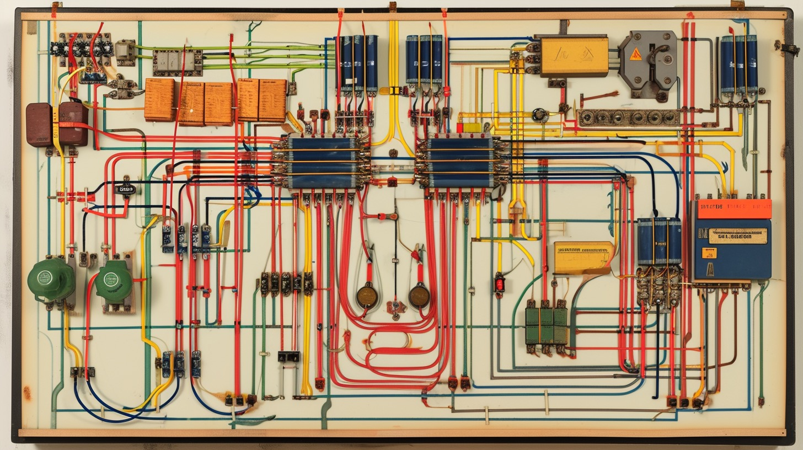

# Godot-Wiring
A simple Godot 4.x plugin that allows efficient name-based access to any node from any other node.

About      | Current Release
-----------|-----------------------
Version    | 1.0
Date       | January 15, 2024
Change Log | [Change Log](ChangeLog.md)
Platform   | Godot 4.x (tested on 4.2)
License    | [MIT License](LICENSE)
Author     | Brom Bresenham

