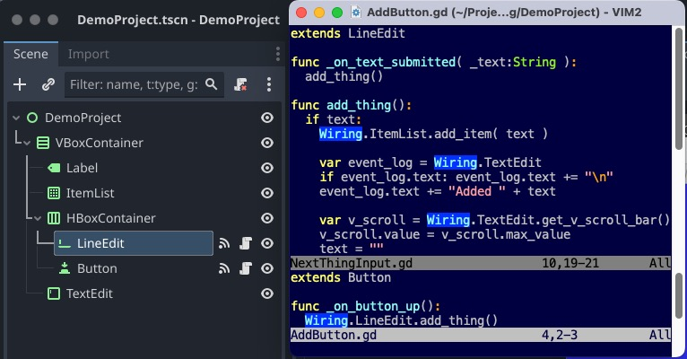
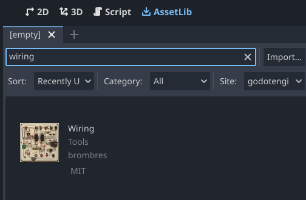
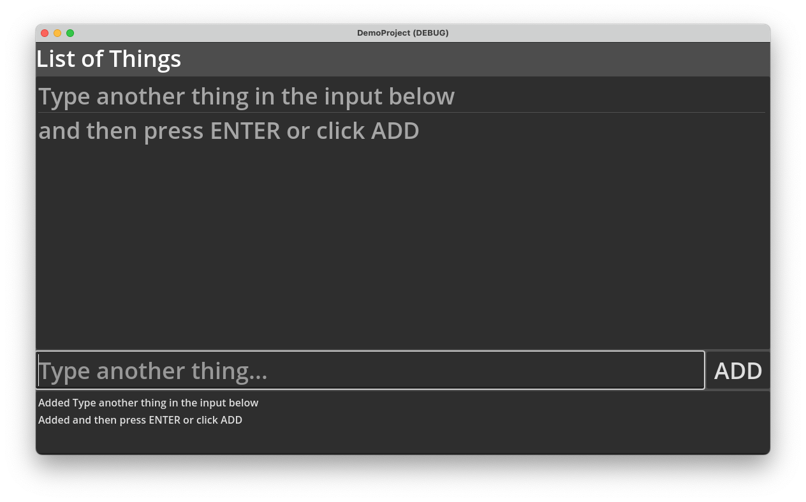

# Godot-Wiring
A simple Godot 4.x plugin that allows efficient name-based access to any scene node from any script.

About      | Current Release
-----------|-----------------------
Version    | 1.0.1
Date       | January 17, 2024
Change Log | [Change Log](ChangeLog.md)
Platform   | Godot 4.x (tested on 4.2)
License    | [MIT License](LICENSE)
Author     | Brom Bresenham

# API

Code                             | Description
---------------------------------|-------------------------
`Wiring.NodeName`                | Locates `NodeName` in the cache or scene tree, caches it if necessary, and returns it.
`Wiring.NodeName = <variant>`    | Assigns or updates the value of `NodeName` in the cache.
`Wiring.clear_cache()`           | Removes all cached values. This happens automatically when the scene changes.

# About

- *Wiring* is a simple and efficient way to programatically access arbitrary scene nodes from any script.
- This plugin adds an autoload singleton named `Wiring` that overrides its property getter and setter methods, `_get()` and `_set()`.
- The first time a `Wiring` property is accessed, the getter finds the node with the specified name in the current scene. The result is cached in a dictionary and returned.
- On subsequent accesses to the same property, the cached value is returned.
- The `Wiring` cache is automatically cleared whenever the scene changes. It can be also be manually cleared with `Wiring.clear_cache()`.
- You can directly set arbitrary `Wiring` properties, which adds them to the cache. This can be done to update the cached reference to a node that has changed in the tree, or to use `Wiring` to implement global variables that only exist for the current scene (and are lost once the scene changes).
- If you set a custom property `Wiring.XYZ = null`, Godot will generate an error if you then attempt to read `Wiring.XYZ`. As a workaround, access `Wiring._cache["XYZ"]` instead.
- Compared to the conventional pattern of exporting node references and setting them in the editor, one advantage of using *Wiring* is that swapping out subtrees is easier to manage. Instead of having to change every reference to the old subtree, setting the new reference in `Wiring` is all that's needed.
- The name "Wiring" comes from the concept of various components being able to communicate with one other through back-end connections (using the analogy of a physical control panel) regardless of how the controls are arranged on the front end.

# Installation

## Installing From Godot AssetLib

1. Switch to the "AssetLib" tab in the Godot editor.
2. Search for "wiring".
3. Click and install the *Wiring* addon.

## Installing From GitHub Release

1. Download the latest [release](https://github.com/brombres/Godot-Wiring/releases).

2. Move or drag the `addons` folder into a Godot project.

## Enabling the Plugin

Enable the plugin under Project > Project Settings... > Plug-ins.

## Demo Project

There's a demo project utilizing *Wiring* in the [Demo Project](DemoProject) folder.

